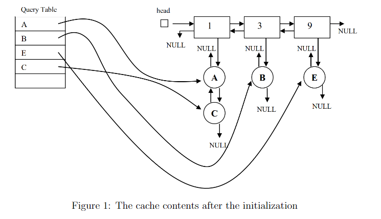
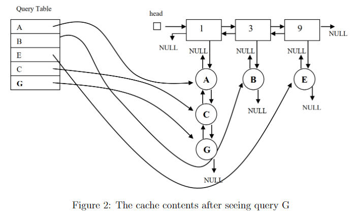
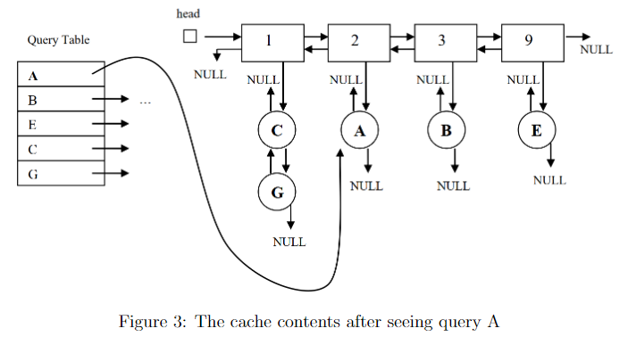
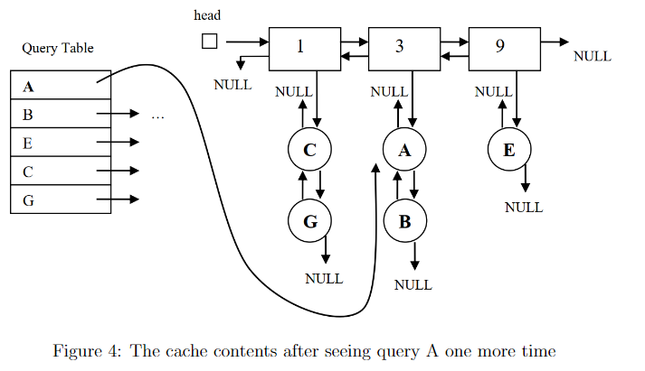
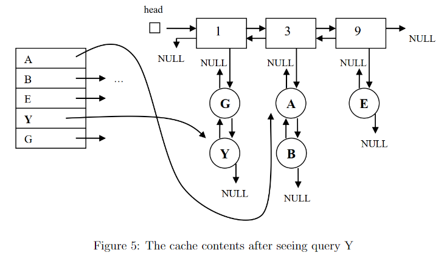

In this project, our goal is simulating the “query result cache” of a typical search engine. The
cache is a memory area where the search engine keeps the queries (and their results) it has seen
previously; and hence, does not need to compute the answer each time a query is sent. For instance,
the first time a user submits the query “sean paul” its result will be computed and stored in the
cache; and if another user sends the same query, the cached answer will be used. Of course, the
cache has a finite capacity, so we can store the upcoming queries as long as there is free space.
When all the available space is consumed, we will remove one of the cached queries to obtain the
space for the new query. To decide on which query to be removed, we will count the number of
times each query is submitted, and remove the query with the smallest count, as shown below.

